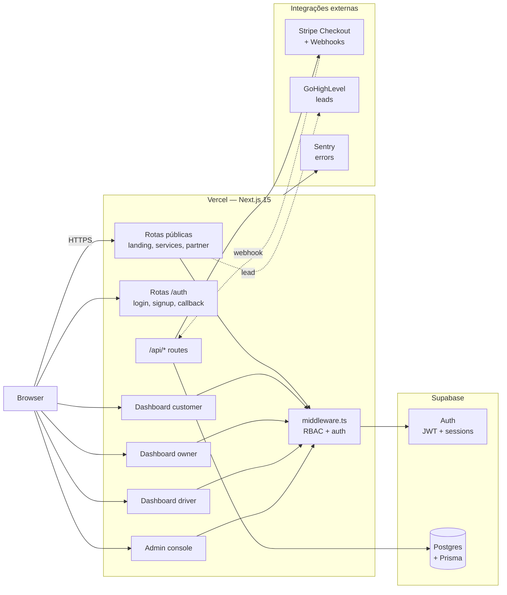
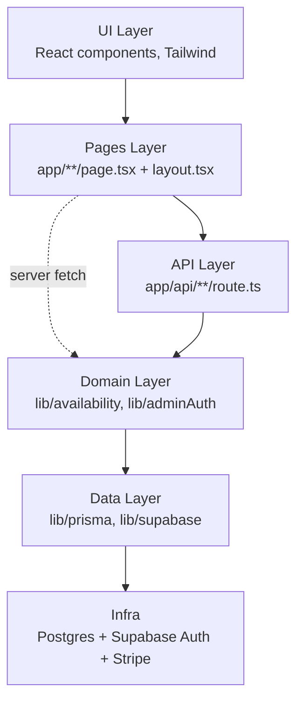
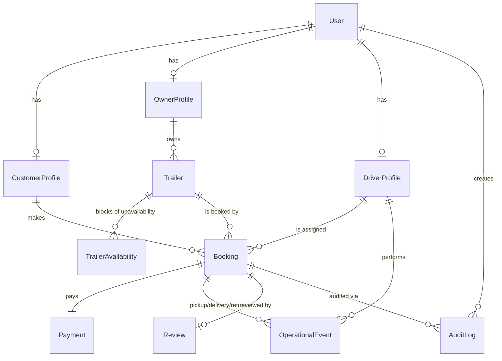
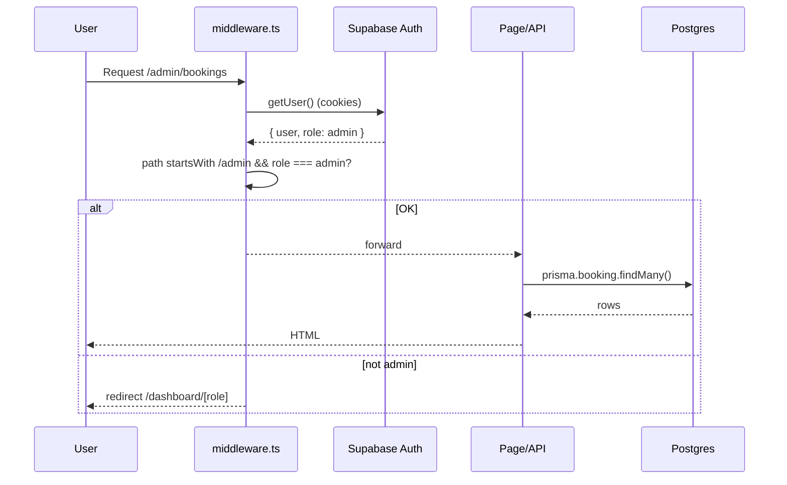
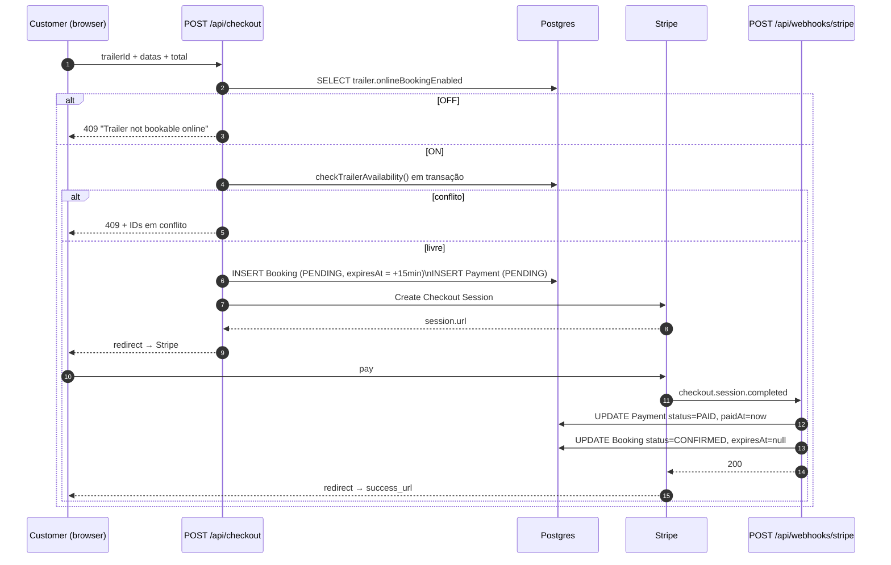
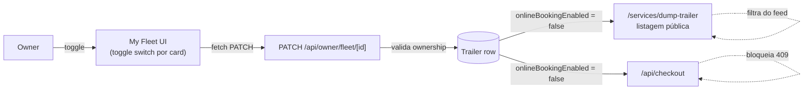

# FAGU Platform — Arquitetura

> Documento técnico vivo. Atualizar sempre que mudar fronteira de serviço, contrato externo ou modelo de dados.

## 1. Visão macro

A FAGU é uma aplicação **monolítica em Next.js 15 (App Router)** rodando server-side e client-side no mesmo projeto, com banco PostgreSQL gerenciado e duas integrações externas (Stripe e Supabase Auth).

## 2. Camadas do código

| Camada | Responsabilidade | Diretório |
|---|---|---|
| UI | Componentes visuais reutilizáveis, sem lógica de negócio | `src/components/` |
| Pages | Composição de UI por rota, server-rendering, redirects | `src/app/**/page.tsx` |
| API | Endpoints REST/RPC, validação de input, idempotência | `src/app/api/**/route.ts` |
| Domain | Regras de negócio puras (disponibilidade, RBAC, expiração) | `src/lib/` |
| Data | Adapters de Prisma e Supabase | `src/lib/prisma.ts`, `src/lib/supabase/` |

## 3. Modelo de dados (alto nível)

Detalhes campo a campo: `prisma/schema.prisma`. Um documento dedicado virá em `docs/DATA_MODEL.md`.

## 4. Autenticação e RBAC

Pontos importantes:

- A role mora em `user.user_metadata.role` (Supabase Auth). Toda decisão de RBAC parte daí.
- `middleware.ts` valida em **toda** request que case com o matcher.
- Server components ainda **revalidam** com `createClient()` para nunca confiar em metadados do client.
- API admin: `requireAdmin()` em `lib/adminAuth.ts` retorna 403 se não-admin.

## 5. Fluxo de booking (instantâneo, com pagamento)

Garantias:

1. **Sem race condition** — disponibilidade é calculada dentro da mesma transação que cria o booking, com índices `(trailerId, serviceDate, status)`.
2. **Sem hold infinito** — `expiresAt` (15 min) + cron `expireStaleBookings()` cancelam pendentes não pagas.
3. **Idempotência** — `stripeCheckoutSessionId @unique` impede duplicação no webhook.

## 6. Owner toggle: reservável online por trailer

Cada `Trailer.onlineBookingEnabled` controla se o trailer é **agendável pela plataforma**.

- Quando OFF: trailer **some das listagens públicas** e qualquer chamada a `/api/checkout` para esse trailer retorna 409.
- Quando OFF: bookings **já confirmadas seguem válidas** — só impede novas.
- Auditoria: cada toggle gera linha em `AuditLog` (action `trailer.onlineBookingToggle`, payload `{ from, to }`).

## 7. Integrações externas

### 7.1 Stripe

- **Checkout Sessions**: `mode: payment`, métodos: `card`. URL de sucesso/cancelamento por env.
- **Webhook**: assinado com `STRIPE_WEBHOOK_SECRET`. Eventos consumidos:
  - `checkout.session.completed` → marca `Payment.PAID`, `Booking.CONFIRMED`.
  - `payment_intent.payment_failed` → `Payment.FAILED`, alerta no admin.
- **Idempotência**: chave `stripeCheckoutSessionId` única no banco, retentativas seguras.

### 7.2 Supabase Auth

- Provedor: e-mail + senha (futuro: Google OAuth).
- Sessões persistidas em cookie HTTP-only.
- Troca de role manual via SQL ou função admin (não exposta no client).

### 7.3 GoHighLevel (opcional)

- Webhooks de captura de lead: contato, partner signup.
- Disparados do client (sem dados sensíveis).

### 7.4 Sentry (recomendado)

- Captura erros server e client.
- Configurar via `SENTRY_DSN`.

## 8. Decisões arquiteturais

| Decisão | Por quê |
|---|---|
| Next.js App Router | SSR + Server Actions evitam APIs intermediárias para queries simples; Prisma roda direto no server. |
| Supabase em vez de Postgres puro | Auth gerenciado, RLS opcional, Storage embutido. Acelera MVP. |
| Prisma em vez de Drizzle/raw SQL | Migrations declarativas, autocomplete forte, bom para uma equipe pequena. |
| Stripe Checkout (hosted) em vez de Elements | Sem PCI-scope, deploy mais simples. Trocamos por Elements quando precisar de UX dentro do app. |
| Pagamento upfront em vez de hold-and-release | Reduz no-show e simplifica reconciliação. Refund é manual via Stripe Dashboard no MVP. |
| Toggle por trailer em vez de por owner | Owners têm múltiplos trailers; precisam controle granular. |
| Monolito em vez de microsserviços | Time pequeno, domínio pequeno. Refatoramos quando volume justificar. |

## 9. Estratégia de testes (a implementar)

- **Unit** — funções puras em `lib/` (Vitest). Foco: `checkTrailerAvailability`, `expireStaleBookings`.
- **Integration** — rotas API com banco de teste (Vitest + Supabase local). Foco: `/api/checkout` (conflict, expired, success).
- **E2E** — Playwright contra ambiente de staging. Smoke: customer faz booking → admin vê confirmado.
- **Webhook** — payloads gravados, replay em ambiente de teste.

## 10. Observabilidade

- **Logs estruturados** — Vercel logs por padrão; futuramente forwardear para Logtail/Axiom.
- **Métricas** — Vercel Analytics + `/api/admin/stats` (interno).
- **Erros** — Sentry com release tracking por commit.
- **Alertas** — webhook do Stripe falhando 3x → Slack via Sentry.

## 11. Risk register (top 5 atual)

1. **Concorrência em booking** — mitigado por transação + índices. Stress test pendente.
2. **Webhook Stripe perdido** — Stripe retenta 3 dias; precisamos endpoint **idempotente** + página admin de reconciliação manual.
3. **Confirmação parcial (DB ok, Stripe falhou)** — booking PENDING expira em 15min via cron. Garantir cron rodando em prod.
4. **Race em toggle** — owner desliga enquanto cliente está no checkout. Mitigamos checando flag dentro da transação de `/api/checkout`.
5. **Vazamento de role** — não usar `role` do client. Sempre revalidar server-side.

## 12. Próximos documentos

- `docs/DATA_MODEL.md` — schema detalhado, regras de negócio por entidade.
- `docs/BOOKING_FLOW.md` — diagrama de estado completo + edge cases.
- `docs/RUNBOOK.md` — operações: deploy, rollback, rotação de segredos, incidentes.
- `docs/API.md` — contrato de cada rota `/api/*`.
